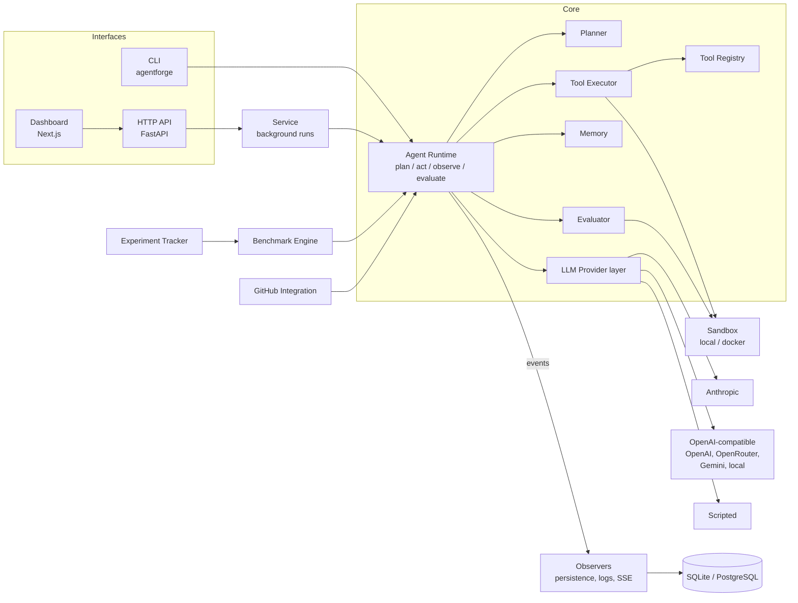

# AgentForge Architecture

AgentForge is an agent *engineering* platform: it assembles agents from
declarative configs, executes them in sandboxes with an instrumented runtime,
records everything they do, evaluates the outcome with deterministic checks,
and runs repeatable benchmarks and experiments across configurations.

## Component map



| Component | Module | Responsibility |
|---|---|---|
| Domain models | `core/` | `AgentConfig`, `Run`, `Step`, `ToolCallRecord`, evaluation results, errors, IDs |
| LLM providers | `llm/` | Provider-neutral message types; adapters; pricing; registry/plugins |
| Runtime | `runtime/agent.py` | The execution loop, retries, limits, cancellation, events |
| Planner | `runtime/planner.py` | `react` (no upfront plan) and `plan_execute` strategies |
| Tools | `tools/` | `Tool` interface, registry with toolsets and entry-point plugins, safe executor, built-ins |
| Sandbox | `sandbox/` | Workspace path confinement; local process and hardened Docker execution |
| Memory | `memory/` | Short-term context compaction; persistent store interface (in-memory, SQL) |
| Evaluation | `evaluation/` | Evaluator interface + built-ins, aggregation, objective run metrics |
| Benchmarks | `benchmarks/` | Suite spec, repeated execution, statistics (Wilson CI, stddev) |
| Experiments | `experiments/` | Variants over a base config, comparison against a baseline |
| Storage | `storage/` | Async SQLAlchemy tables and repositories; persistence observer |
| Service | `service.py` | Background execution of runs/benchmarks/experiments for the API |
| API | `api/` | REST + SSE endpoints, API-key auth |
| GitHub | `integrations/github/` | REST client, tools, issue → PR workflow |
| Observability | `observability/`, `runtime/events.py` | Structured JSON logs, secret redaction, lifecycle events |

## The agent loop

```
goal ─► recall memories ─► (plan) ─► ┌──────────────────────────────────────┐
                                     │ LLM call (retry w/ backoff)          │
                                     │ tool calls? ─yes─► execute each tool │──► observations
                                     │      │ no                            │      back to LLM
                                     │      ▼                               │
                                     │ final answer ─► evaluate             │
                                     │   passed / out of retries ─► finish  │
                                     │   failed & retries left ─► feedback ─┘
                                     └──────────────────────────────────────┘
limits: max_steps · timeout · max_tool_calls · consecutive tool-error cap · cancellation
```

- Every run records `run_id`, status, timestamps, steps (with the LLM call
  record and all tool calls), errors, result, evaluation and metrics, plus the
  **config snapshot** and evaluator specs, so a run can be reproduced
  (`POST /runs/{id}/rerun`).
- **Status vs. success**: `status` describes execution (`succeeded` = the
  agent produced a final answer). Task success is `evaluation.passed`.
- Failed/timed-out runs are still evaluated (post-mortem) so benchmarks score
  them; cancelled runs are not.
- Retries: transient LLM errors (rate limits, 5xx, network) are retried per
  `RetryPolicy` with jittered exponential backoff; SDK-internal retries are
  disabled so attempt counts are accurate. `evaluation_retries` lets the agent
  continue with evaluator feedback after a failed check.

## Key design decisions

| Decision | Rationale |
|---|---|
| **Official SDKs as optional extras** (`anthropic`, `openai`), imported lazily inside adapters | Correct wire handling and typed errors without making the core depend on any vendor. |
| **One OpenAI-compatible adapter** serves OpenAI, OpenRouter, Gemini (its OpenAI-compatible endpoint) and local servers | Chat Completions is the common denominator; presets differ only in URL, key and token-parameter name. A native Gemini adapter is a planned enhancement. |
| **Opaque `ProviderPart`** in the neutral message format | Some APIs (e.g. Anthropic thinking blocks) require blocks to be echoed back verbatim; other providers drop them, keeping conversations portable. |
| **Runtime owns retries** | One source of truth for attempts, backoff and recorded retry metrics. |
| **Tool executor wraps every call** | Tools stay small; validation, permission policy, timeouts, truncation, redaction and records are uniform. |
| **Docker CLI (not SDK) for sandboxes** | No extra dependency; the argv is easy to audit and unit-test. |
| **SQLite default, PostgreSQL in compose** | Zero-config local use; same code via async SQLAlchemy. JSON columns for nested documents, real columns for filters/aggregates. |
| **No migrations yet** (`create_all`) | Schema still changing quickly; Alembic is a P1 task before the public beta. |
| **In-process background execution** (asyncio tasks, semaphore) | Simple and reliable for a single node. Redis/worker queue deferred until multi-node execution is needed — Redis is intentionally *not* a dependency yet. |
| **Lifecycle events + observers** | Persistence, logs and live SSE share one mechanism; OpenTelemetry export can be added as another observer. |
| **Lexical (BM25-style) memory search** | Dependency-free and deterministic; `MemoryStore.search` is the seam for a vector store. |
| **Benchmarks as normal runs** | Every benchmark attempt is a fully recorded run, inspectable in the same UI. Task/suite limits act as caps on the agent's own limits. |
| **Wilson score intervals** | Benchmark samples are small and pass rates near 0/1; comparisons show uncertainty rather than implying rankings. |
| **Scripted provider** | Deterministic, offline end-to-end tests and demos; explicitly not a model. |
| **argparse CLI** | No extra dependency for a modest command surface. |

## Trust boundaries

See `SECURITY.md`. In short: agent-generated commands are untrusted and run in
the sandbox with a scrubbed environment; secrets stay in the AgentForge
process; GitHub pushes are done by AgentForge, never by the agent; the local
sandbox is **not** a security boundary.

## Data model (tables)

`agents` · `runs` (config snapshot, steps JSON, metrics, evaluation, labels) ·
`tool_calls` (denormalised for analytics) · `memories` · `benchmark_runs` ·
`experiments`.
