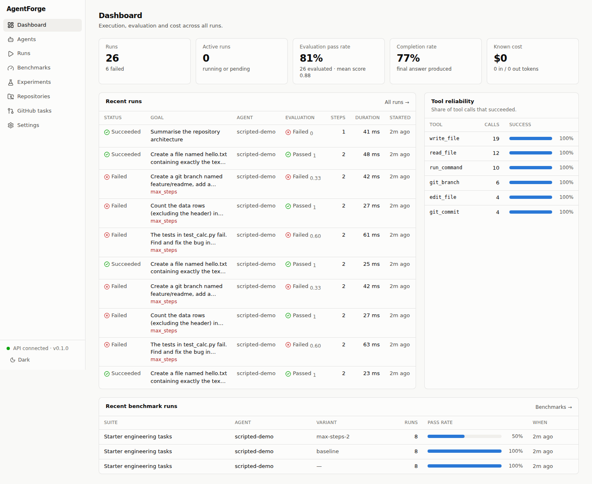
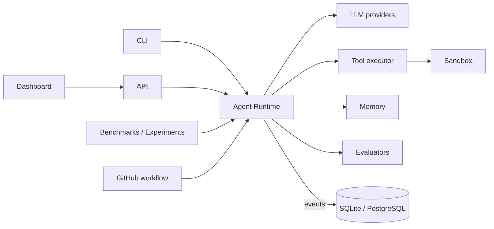
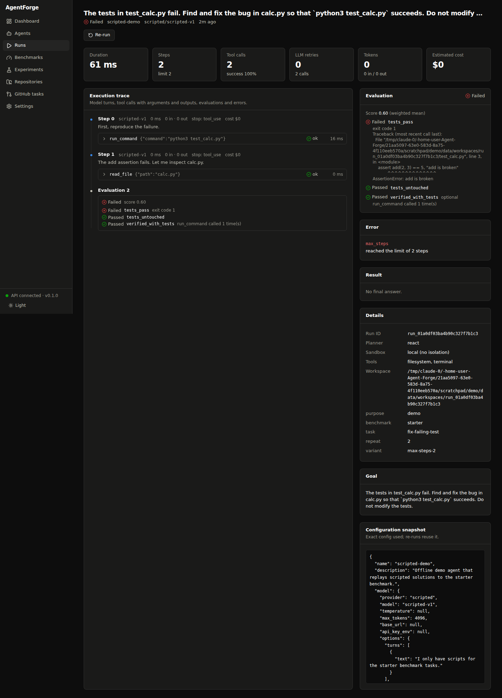
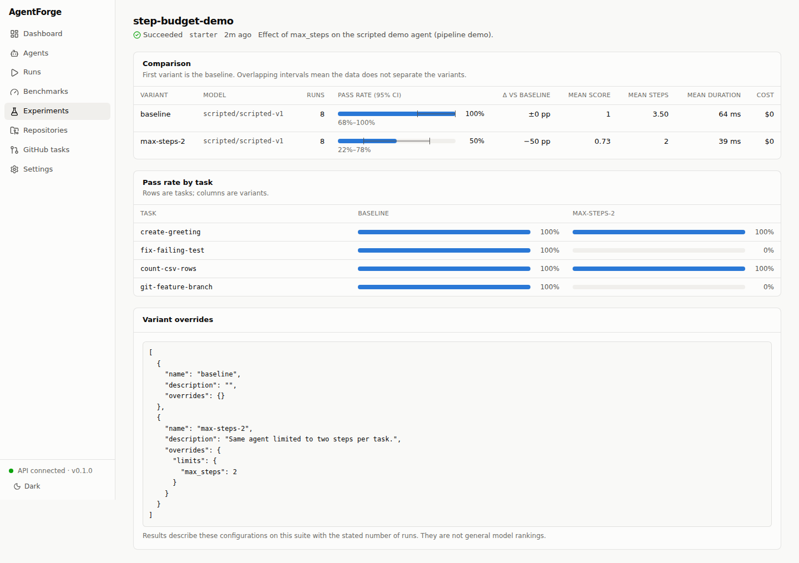
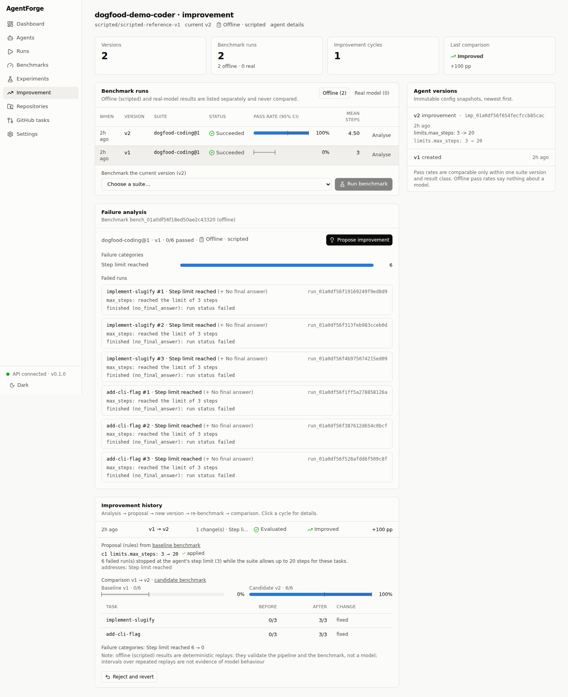
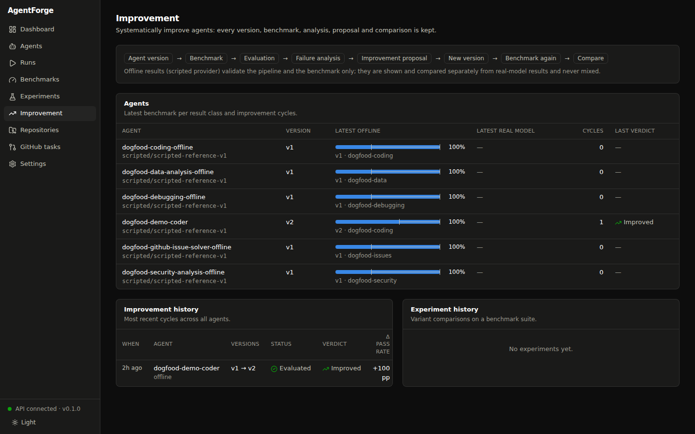

# AgentForge

**An open-source Agent CI/CD and evaluation platform.**

AgentForge treats an LLM agent the way CI/CD treats code: every agent
configuration (model, prompt, tools, memory, limits, sandbox) is a stored,
versioned artifact; every run is recorded and reproducible; every change is
evaluated against the same benchmark before it is trusted.

```
BUILD ─► RUN ─► EVALUATE ─► FAILURE ANALYSIS ─► IMPROVE ─► RE-RUN ─► REGRESSION CHECK
  │                                                                        │
  └──────────────────────── next agent version ◄───────────────────────────┘
```

| Stage | What exists |
|---|---|
| BUILD | Declarative agent configs (YAML), stored as immutable versions |
| RUN | Instrumented runtime; sandboxed tools (per-run workspace, hardened Docker sandbox); every step, tool call, token count and error recorded |
| EVALUATE | Deterministic evaluators (tests, file/output checks, tool usage, step budgets), optional LLM judge; benchmark suites with visible, hidden and process checks |
| FAILURE ANALYSIS | Each failed run classified from its record (step limit, tests failed, tool errors, provider errors, ...) with evidence |
| IMPROVE | Rule-based or manual proposals limited to an allowlist of config paths; applied as a new agent version |
| RE-RUN | The new version benchmarked on the baseline's exact suite snapshot |
| REGRESSION CHECK | Baseline-vs-candidate comparison with Wilson intervals and a verdict (`improved`, `regressed`, `inconclusive`, ...); `improve run` reverts a regression as a new version |

It is not primarily another LLM wrapper: it works with Anthropic, OpenAI,
Gemini, OpenRouter, OpenCode Go and local models, but its focus is what
happens around the model — versioned agents, reproducible execution, sandboxed
tool use, benchmark evaluation, failure analysis, agent improvement and
regression detection.

Many projects cover parts of this space (tracing and observability platforms,
evaluation harnesses, agent frameworks). AgentForge's approach is to keep the
whole loop — versioned configuration, sandboxed execution, evaluation, failure
analysis, proposal, re-run and comparison — in one self-hosted tool with one
data model, so that an agent change can be traced from the failure that
motivated it to the benchmark that confirmed or rejected it.

> Status: alpha (pre-release, 0.1.0). Core engine, API, CLI, dashboard,
> benchmarks, improvement loop and GitHub workflow are implemented and tested.
> Validated with real models on a small scale (see
> [Real-model validation](#real-model-validation)). Not yet implemented: a CI
> gate that fails a pipeline on a regression (today `bench compare` reports
> the verdict; wiring it into a pipeline is up to you). See
> [ROADMAP.md](ROADMAP.md) and [docs/STATUS.md](docs/STATUS.md).



## Features

- **Multi-provider**: Anthropic (Claude), OpenAI, OpenRouter, Gemini
  (OpenAI-compatible endpoint), OpenCode Go (OpenAI-compatible endpoint, set
  `model.base_url`), local OpenAI-compatible servers (Ollama, vLLM,
  LM Studio), plus a deterministic *scripted* provider for offline tests.
- **Instrumented runtime**: ReAct or plan-and-execute loop with LLM retry
  policies, timeouts, cancellation, step and tool-call budgets, and
  evaluation-driven retries. Every run records steps, tool calls, errors,
  token usage, estimated cost (only when pricing is known) and evaluation.
- **Tools with guardrails**: filesystem, terminal, git, HTTP and GitHub tools
  behind a plugin registry; every call is schema-validated, permission-checked,
  time-limited, truncated and secret-redacted.
- **Sandboxes**: per-run workspaces; a hardened Docker sandbox (no network,
  read-only root, dropped capabilities, resource limits, non-root).
- **Memory**: context compaction for long runs, persistent per-agent memory
  with recall, and `remember`/`recall` tools.
- **Evaluation**: built-in evaluators (tests pass, file checks, output checks,
  step budgets, tool usage, LLM judge) and custom Python evaluators.
- **Benchmarks & experiments**: YAML suites with initial state, allowed tools
  and success criteria; repeated runs with confidence intervals; experiments
  that compare models, prompts, tools or strategies against a baseline.
- **Agent improvement loop**: agent version → benchmark → evaluation →
  failure analysis → improvement proposal → new version → benchmark again →
  comparison, with the full history kept (immutable agent versions, suite
  snapshots, analyses, proposals, verdicts). See
  [docs/improvement.md](docs/improvement.md).
- **Honest results**: offline (scripted) and real-model results are separate
  result classes that are never mixed; unmeasured values (tokens, cost) are
  `null`, never guessed.
- **Dogfooding**: six agents (coding, debugging, data analysis, security
  analysis, GitHub issue solving, and an engineering agent for the harder
  `dogfood-hard` suite) with reproducible tasks, hidden checks and offline
  reference solutions — see [dogfood/README.md](dogfood/README.md).
- **GitHub**: issue → repository analysis → implementation → tests →
  evaluation → branch → commit → **draft** PR. AgentForge never merges.
- **Observability**: structured JSON logs with secret redaction, live
  server-sent events, OpenTelemetry traces (GenAI conventions) and
  Prometheus metrics — see [docs/observability.md](docs/observability.md).
- **Interfaces**: CLI, REST API with live server-sent events, and a web
  dashboard with execution traces, evaluation results, benchmark history and
  experiment comparisons.

## Architecture



Details, design decisions and trust boundaries: [ARCHITECTURE.md](ARCHITECTURE.md).

## Installation

Requires Python 3.12+.

```bash
git clone https://github.com/ege-arhan/Agent-Forge && cd Agent-Forge
uv sync --all-extras            # or: pip install -e '.[all]'
source .venv/bin/activate
```

Extras: `anthropic`, `openai` (also used for OpenRouter, Gemini and local
servers), `postgres`, `otel`, `all`.

With Docker Compose (API + PostgreSQL + dashboard):

```bash
cp .env.example .env            # add provider keys
docker compose up --build       # dashboard http://localhost:3000, API http://localhost:8000/docs
```

## Quick start (offline, no API key)

The scripted demo agent replays fixed solutions, so you can see the whole
pipeline without a model. Its scores say nothing about real models.

```bash
agentforge bench run examples/benchmarks/starter.yaml -a examples/agents/scripted-demo.yaml
agentforge runs list
agentforge runs show <run-id>
```

With a real model:

```bash
export ANTHROPIC_API_KEY=...
agentforge run examples/agents/anthropic-coder.yaml \
  --goal "Create fizzbuzz.py and a test for it, then run the test" \
  --eval '{"type": "command", "command": "python3 -m pytest -q"}'
```

The real-model example agents run commands in the Docker sandbox using an
image with Python, git and pytest. Build it once:

```bash
docker build -f docker/sandbox.Dockerfile -t agentforge-sandbox:latest .
```

(or switch `sandbox.kind` to `local` for trusted experiments on your own
machine — the local sandbox provides no isolation).

## Creating an agent

Agents are YAML/JSON documents validated by `AgentConfig`:

```yaml
name: my-coder
model:
  provider: anthropic          # anthropic | openai | openrouter | gemini | opencode-go | local | scripted
  model: claude-opus-5
  max_tokens: 16000
  # api_key_env: MY_KEY_VAR    # defaults to the provider's standard variable
system_prompt: |
  You are a careful software engineer...
tools: [filesystem, terminal, git, memory]   # toolsets or individual tool names
tool_settings:
  http_request: {allowed_hosts: ["api.example.com"]}
limits: {max_steps: 30, timeout_seconds: 900, max_tool_calls: 100}   # optional: max_total_tokens
retry: {llm_max_attempts: 4, evaluation_retries: 1}
planner: {strategy: react}      # or plan_execute
memory: {persist: true, recall_limit: 5}
sandbox: {kind: docker, image: agentforge-sandbox:latest, network: none, memory: 1g}
approval: {require_for: [process:exec, network], timeout_seconds: 3600}
```

More examples in [`examples/agents/`](examples/agents). Store agents for the
API/dashboard with `agentforge agents create my-coder.yaml` or
`POST /api/v1/agents`.

## Running agents

- CLI: `agentforge run AGENT.yaml --goal "..." [--eval SPEC]...` prints a live
  trace and a summary; exit code is non-zero if the run or its evaluation fails.
- API: `POST /api/v1/runs {"agent_id": "...", "goal": "...", "evaluators": [...]}`
  returns immediately; follow with `GET /api/v1/runs/{id}` or the SSE stream
  `GET /api/v1/runs/{id}/events`. `POST /runs/{id}/cancel` stops a run;
  `POST /runs/{id}/rerun` reproduces it from its stored config snapshot.

## Tools

| Toolset | Tools | Permissions |
|---|---|---|
| `filesystem` | `read_file`, `write_file`, `edit_file`, `list_directory`, `search_files` | `fs:read`, `fs:write` |
| `terminal` | `run_command` | `process:exec` |
| `git` | `git_status`, `git_diff`, `git_log`, `git_commit`, `git_branch` | `git:read`, `git:write` |
| `http` | `http_request` (public hosts only, optional allowlist) | `network` |
| `github` | `github_get_repository`, `github_list_issues`, `github_get_issue`, `github_comment_issue`, `github_create_pull_request` (draft) | `github:read`, `github:write` |
| `memory` | `remember`, `recall` | `memory` |

`agentforge tools` lists them with schemas. Operators can deny permissions
globally (`AGENTFORGE_DENIED_PERMISSIONS=network,github:write`). Custom tools
plug in via the `agentforge.tools` entry-point group — see
[docs/tools.md](docs/tools.md).

### Human approval for sensitive tools

Set `approval.require_for` on an agent to a list of permissions (`fs:write`,
`process:exec`, `network`, `git:write`, `github:write`, ...); a run pauses
(`status: awaiting_approval`) before any tool call needing one of them,
instead of executing it. Resolve it with:

- API: `GET /api/v1/runs/{id}/approvals` lists pending calls;
  `POST /api/v1/runs/{id}/approvals/{call_id} {"approved": true, "reason": "..."}`
  decides one and lets the run continue. The dashboard's run page shows the
  same as a "Pending approval" card with Approve/Deny buttons.
- CLI (`agentforge run`, which executes in the same process): prompts on the
  terminal; without a TTY it auto-denies so the run cannot hang unattended.

A denial fails only that tool call (the agent sees why and can try something
else); the run keeps going. Unanswered after `approval.timeout_seconds`
(default 1h) is treated as a denial too.

## Memory

- **Short-term**: the conversation window; old large tool outputs are
  compacted beyond `memory.keep_recent_messages`.
- **Persistent agent memory**: with `memory.persist: true`, a summary of every
  run is stored; relevant memories are recalled into the system prompt of
  later runs. Agents can also use `remember`/`recall` explicitly.
- Search is lexical (BM25-style); the `MemoryStore` interface is ready for a
  vector store.

## Evaluation

Evaluators produce a pass/fail and a score in [0, 1]; the run's evaluation is
the weighted mean, and it passes when all *required* evaluators pass.

| Type | Checks |
|---|---|
| `completed` | the agent finished with a final answer |
| `command` | a command (e.g. the test suite) exits with the expected code |
| `file_exists`, `file_contains` | workspace state |
| `output_contains`, `output_matches` | the final answer |
| `max_steps`, `tool_used` | efficiency / behaviour |
| `llm_judge` | a separately configured judge model scores against a rubric |
| `python` | your own `Evaluator` subclass |

Run metrics (duration, steps, LLM calls and retries, tool calls and success
rate, errors, tokens, estimated cost) are computed only from recorded data.
See [docs/evaluation.md](docs/evaluation.md).

## Benchmarks and experiments

A suite defines tasks with an initial state, allowed tools, expected
behaviour, success criteria (evaluators), timeouts and step budgets:

```bash
agentforge bench run examples/benchmarks/starter.yaml -a examples/agents/anthropic-coder.yaml -r 3
agentforge experiment run examples/experiments/model-comparison.yaml
```

Results include pass rates with 95% Wilson confidence intervals, score
spread, duration, steps, tokens and cost.

Improve an agent from a baseline benchmark:

```bash
agentforge bench run dogfood/benchmarks/coding.yaml -a MY_AGENT.yaml --save-agent -r 3
agentforge improve run <benchmark-id>      # analyse → propose → new version → re-benchmark → compare
agentforge improve history my-agent
``` Experiments compare variants of a
base config (model, prompt, tools, planner, limits) against the first variant.
Results describe those configurations on that suite — they are not general
model rankings. See [docs/benchmarks.md](docs/benchmarks.md).

## Real-model validation

Small-scale, and documented in full in
[docs/REAL_MODEL_BENCHMARK.md](docs/REAL_MODEL_BENCHMARK.md). All runs through
OpenCode Go, one run per task, no retries.

- **Multi-model execution** — 5 models (`deepseek-v4.1-flash`,
  `mimo-v2.6-flash`, `muse-spark-1.3-contributor`, `glm-5.3-flash`,
  `kimi-k2.7-code`) × 2 existing dogfood tasks: 10 task executions, all passed.
  The tasks turned out too easy to differentiate the models.
- **Hard benchmark** — `dogfood-hard` v1 (4 tasks with hidden and
  mutation-based checks), validated offline; `deepseek-v4.1-flash` passed the
  two tasks it was run on.
- **Improvement loop on a real model (controlled)** — the same model with a
  deliberately tight, documented step limit (8) failed `ledger-root-causes` at
  the step limit; AgentForge classified the failure, proposed
  `limits.max_steps: 8 → 25`, stored v2, re-ran the identical task, and v2
  passed; comparison verdict `inconclusive` (one run each).

What this is not: the demonstrated improvement is a **configuration** change
that removes a constraint chosen for the demonstration — **not evidence of the
model learning** or becoming more capable. The sample is far too small for
model rankings or significance. Cost was not available from OpenCode Go and
is reported as NOT AVAILABLE. OFFLINE (scripted) and REAL results are stored
and reported separately and never combined.

## Dashboard

A Next.js + TypeScript + Tailwind dashboard in [`web/`](web) (UI primitives
follow shadcn/ui conventions):

| Page | Shows |
|---|---|
| Dashboard | runs, active runs, evaluation pass rate, completion rate, known cost, recent runs, tool reliability, recent benchmarks |
| Agents / agent detail | stored configs, start a run with evaluators, the agent's runs |
| Runs / run detail | filterable run list; trace of every step (model turn, tool calls with arguments and outputs, evaluations, errors), metrics, config snapshot, cancel and re-run; live updates while running |
| Benchmarks / benchmark detail | suites and tasks, start a benchmark, history, per-task pass rates, results linked to runs, environment |
| Experiments / experiment detail | start an experiment, variant comparison with 95% intervals and deltas, per-task matrix |
| Improvement / agent improvement | agent versions with config diffs, benchmark runs split into offline and real, failure categories with evidence, improvement cycles (proposal, comparison, apply / evaluate / reject), improvement and experiment history |
| Repositories | inspect a GitHub repository, pick an issue, start an issue task |
| GitHub tasks | issue tasks with branch, commits and draft-PR links |
| Settings | API URL/key, providers, tools, evaluators |

```bash
agentforge serve                       # API on :8000
cd web && npm ci && npm run dev        # dashboard on :3000
```

| Run detail (dark) | Experiment comparison |
|---|---|
|  |  |

| Agent improvement (offline demo data) | Improvement overview (dark) |
|---|---|
|  |  |

## GitHub integration

```bash
export GITHUB_TOKEN=...   # repo scope
agentforge github issues owner/repo
agentforge github solve owner/repo 42 -a examples/agents/github-issue-solver.yaml \
  --test-command "pytest -q" --push --open-pr
```

The same workflow is available from the dashboard (*Repositories*) and the API
(`POST /api/v1/github/tasks`).

AgentForge clones the repository, creates `agentforge/issue-42-<slug>`, runs
the agent (which never sees the token), verifies commits and tests, and — only
if requested and the evaluation passed — pushes the branch and opens a
**draft** pull request. There is no merge capability. See
[docs/github.md](docs/github.md).

## Security

Agent output is untrusted. Use the Docker sandbox for anything but trusted
local experiments; the local sandbox provides no isolation. Secrets are kept
out of child processes and redacted from logs and records. Full model and
limitations: [SECURITY.md](SECURITY.md).

## Development

```bash
uv run ruff check . && uv run ruff format --check . && uv run mypy && uv run pytest
```

See [DEVELOPMENT.md](DEVELOPMENT.md). CI runs lint, strict type checking,
tests on Python 3.12/3.13, PostgreSQL and Docker-sandbox tests, dashboard lint/
type check/tests/build, image builds, dependency audit, secret scanning and
CodeQL.

## Roadmap

See [ROADMAP.md](ROADMAP.md) and [TASKS.md](TASKS.md). Next: public beta
(M15) — real-model dogfooding results once credentials are available.

## License

Apache-2.0.
